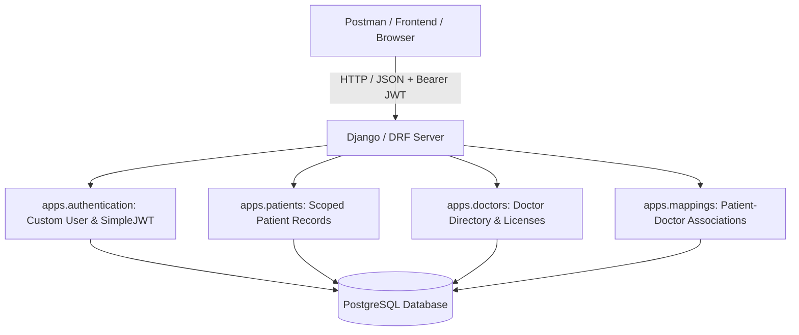

# 🏥 Healthcare Backend API

> **Assignment Submission for Backend Developer Intern — WhatBytes**  
> Built with **Django 5**, **Django REST Framework (DRF)**, **SimpleJWT**, and **PostgreSQL**.

---

## 📌 Table of Contents
- [Project Overview](#-project-overview)
- [Architecture & Tech Stack](#-architecture--tech-stack)
- [Project Structure](#-project-structure)
- [Quick Start](#-quick-start)
  - [Option A: 1-Command Setup with Docker Compose (Recommended)](#option-a-docker-compose-recommended)
  - [Option B: Local Setup with Python Virtual Environment](#option-b-local-virtual-environment)
- [Environment Configuration](#-environment-configuration)
- [API Documentation & Interactive Swagger UI](#-api-documentation)
- [API Reference](#-api-reference)
  - [1. Authentication APIs](#1-authentication-apis)
  - [2. Patient Management APIs](#2-patient-management-apis)
  - [3. Doctor Management APIs](#3-doctor-management-apis)
  - [4. Patient-Doctor Mapping APIs](#4-patient-doctor-mapping-apis)
- [Postman Collection](#-postman-collection)
- [Running Automated Tests](#-running-automated-tests)
- [Sample Seed Data](#-sample-seed-data)
- [License & Submission](#-submission-details)

---

## 🌟 Project Overview

This backend system provides a secure, production-grade RESTful API for healthcare record management. It enables:
- **Secure Authentication**: Email-based user accounts with JWT (`access` and `refresh` tokens) via `djangorestframework-simplejwt`.
- **Patient Management**: Secure CRUD operations on patient records, isolated so authenticated users only view and manage their own patients.
- **Doctor Directory**: Management of doctors, specializations, unique medical license verification, and searchable doctor directory.
- **Patient-Doctor Mappings**: Assigning doctors to patients with database-level uniqueness constraints preventing duplicate assignments, and listing all doctors mapped to a given patient.
- **Centralized Error Handling**: Standardized JSON envelopes across all HTTP 400, 401, 403, 404, and 500 responses.
- **OpenAPI 3.0 / Swagger UI**: Built-in interactive documentation powered by `drf-spectacular`.

---

## 🛠️ Architecture & Tech Stack



- **Framework**: Django 5.1 & Django REST Framework 3.15
- **Authentication**: JWT (`djangorestframework-simplejwt`)
- **Database**: PostgreSQL 16+ (with configurable fallback to SQLite)
- **API Documentation**: OpenAPI 3.0 via `drf-spectacular`
- **Testing**: `pytest` and `pytest-django` (35 automated tests)
- **Containerization**: Docker & Docker Compose

---

## 📂 Project Structure

```text
Healthcare Django/
├── apps/
│   ├── authentication/             # Custom User model, email login & JWT
│   │   ├── management/commands/    # seed_data command
│   │   ├── models.py               # Custom User with email as username
│   │   ├── serializers.py          # Register, Login, UserProfile serializers
│   │   ├── views.py                # Register & Login APIViews
│   │   └── urls.py                 # /api/auth/*
│   │
│   ├── patients/                   # Patient Management App
│   │   ├── models.py               # Patient model with user ownership FK
│   │   ├── serializers.py          # Input validation & creator metadata
│   │   ├── views.py                # User-scoped List/Create & Detail views
│   │   └── urls.py                 # /api/patients/*
│   │
│   ├── doctors/                    # Doctor Directory App
│   │   ├── models.py               # Doctor with unique license & email
│   │   ├── serializers.py          # Specialty & uniqueness validation
│   │   ├── views.py                # Directory CRUD & Search/Filter views
│   │   └── urls.py                 # /api/doctors/*
│   │
│   └── mappings/                   # Patient-Doctor Mapping App
│       ├── models.py               # UniqueConstraint(patient, doctor)
│       ├── serializers.py          # Assignment & Detailed representations
│       ├── views.py                # Mapping CRUD & Patient-doctor list
│       └── urls.py                 # /api/mappings/*
│
├── core/
│   ├── settings.py                 # decouple environment configuration
│   ├── exceptions.py               # Standardized JSON error response handler
│   ├── urls.py                     # Main router + Swagger/Redoc endpoints
│   └── wsgi.py
│
├── tests/
│   ├── test_authentication.py      # Auth tests (register, login, JWT, profile)
│   ├── test_patients.py            # Patient tests (isolation, CRUD, unauthorized)
│   ├── test_doctors.py             # Doctor tests (unique license, search, CRUD)
│   └── test_mappings.py            # Mapping tests (assignment, duplicates, delete)
│
├── docker-compose.yml              # Multi-container orchestration (Postgres + Web)
├── Dockerfile                      # Production Python container
├── requirements.txt                # Python dependencies
├── pytest.ini                      # Pytest runner configuration
├── .env.example                    # Environment template
├── healthcare_api_postman_collection.json # Ready-to-import Postman collection
└── README.md
```

---

## 🚀 Quick Start

### Option A: Docker Compose (Recommended)

Requires [Docker Desktop](https://www.docker.com/products/docker-desktop) installed.

```bash
# 1. Clone repository and navigate to folder
git clone <your-repo-link>
cd "Healthcare Django"

# 2. Start services (builds image, runs Postgres, applies migrations, seeds sample data)
docker compose up --build
```

The API will immediately be live at:
- **API Root**: `http://localhost:8000/api/`
- **Interactive Swagger UI**: `http://localhost:8000/api/docs/`
- **ReDoc UI**: `http://localhost:8000/api/redoc/`

---

### Option B: Local Virtual Environment

#### 1. Prerequisites
- Python 3.11+
- PostgreSQL server running locally (or SQLite)

#### 2. Create Virtual Environment & Install Dependencies
```bash
python -m venv venv

# Windows:
.\venv\Scripts\activate

# macOS / Linux:
source venv/bin/activate

pip install -r requirements.txt
```

#### 3. Configure Environment Variables
Copy `.env.example` to `.env`:
```bash
cp .env.example .env
```
Ensure your PostgreSQL credentials in `.env` match your local database:
```ini
DEBUG=True
SECRET_KEY=your-secret-key
DB_ENGINE=postgresql
DB_NAME=healthcare_db
DB_USER=postgres
DB_PASSWORD=your_password
DB_HOST=localhost
DB_PORT=5432
```
*(Tip: Set `DB_ENGINE=sqlite` if you want to run zero-setup on SQLite)*

#### 4. Run Migrations & Seed Sample Data
```bash
python manage.py migrate
python manage.py seed_data
```

#### 5. Start Development Server
```bash
python manage.py runserver
```

---

## ⚙️ Environment Configuration

| Variable | Default | Description |
| :--- | :--- | :--- |
| `DEBUG` | `True` | Django debug mode |
| `SECRET_KEY` | *(secure fallback)* | Cryptographic signing key |
| `ALLOWED_HOSTS` | `localhost,127.0.0.1,0.0.0.0` | Permitted hostnames |
| `DB_ENGINE` | `postgresql` | `postgresql` or `sqlite` |
| `DB_NAME` | `healthcare_db` | PostgreSQL database name |
| `DB_USER` | `postgres` | Database username |
| `DB_PASSWORD` | `password` | Database password |
| `DB_HOST` | `localhost` / `db` | Database host |
| `DB_PORT` | `5432` | PostgreSQL port |
| `CORS_ALLOW_ALL_ORIGINS` | `True` | Enable Cross-Origin requests |

---

## 📖 API Documentation

Once the server is running, access full interactive documentation:
- **Swagger UI**: [`http://127.0.0.1:8000/api/docs/`](http://127.0.0.1:8000/api/docs/)
- **ReDoc UI**: [`http://127.0.0.1:8000/api/redoc/`](http://127.0.0.1:8000/api/redoc/)
- **OpenAPI 3.0 Schema**: [`http://127.0.0.1:8000/api/schema/`](http://127.0.0.1:8000/api/schema/)

---

## 📋 API Reference

### 1. Authentication APIs

All endpoints accept and return JSON.

#### `POST /api/auth/register/`
Register a new user account.
```bash
curl -X POST http://127.0.0.1:8000/api/auth/register/ \
  -H "Content-Type: application/json" \
  -d '{
    "name": "Dr. Alice Morgan",
    "email": "alice@healthcare.test",
    "password": "SecurePassword123!"
  }'
```
**Response (201 Created):**
```json
{
  "success": true,
  "message": "User registered successfully.",
  "data": {
    "user": {
      "id": 3,
      "name": "Dr. Alice Morgan",
      "email": "alice@healthcare.test",
      "created_at": "2026-09-29T07:00:00Z"
    },
    "tokens": {
      "access": "eyJhbGciOi...",
      "refresh": "eyJhbGciOi..."
    }
  }
}
```

#### `POST /api/auth/login/`
Authenticate user and obtain JWT tokens.
```bash
curl -X POST http://127.0.0.1:8000/api/auth/login/ \
  -H "Content-Type: application/json" \
  -d '{
    "email": "doctor.demo@healthcare.com",
    "password": "DoctorPass123!"
  }'
```

#### `POST /api/auth/token/refresh/`
Refresh an expired JWT access token.
```bash
curl -X POST http://127.0.0.1:8000/api/auth/token/refresh/ \
  -H "Content-Type: application/json" \
  -d '{"refresh": "<REFRESH_TOKEN>"}'
```

#### `GET /api/auth/me/`
Retrieve profile of currently authenticated user.
```bash
curl -X GET http://127.0.0.1:8000/api/auth/me/ \
  -H "Authorization: Bearer <ACCESS_TOKEN>"
```

---

### 2. Patient Management APIs

> 🔒 **Requires:** `Authorization: Bearer <ACCESS_TOKEN>`

| Method | Endpoint | Description |
| :--- | :--- | :--- |
| `POST` | `/api/patients/` | Register a new patient (assigned to `request.user`) |
| `GET` | `/api/patients/` | Retrieve all patients created by the authenticated user |
| `GET` | `/api/patients/<id>/` | Get details of a specific patient record |
| `PUT` | `/api/patients/<id>/` | Update all patient details |
| `PATCH`| `/api/patients/<id>/` | Partially update patient details |
| `DELETE`| `/api/patients/<id>/` | Delete a patient record |

**Example: Add Patient (`POST /api/patients/`)**
```bash
curl -X POST http://127.0.0.1:8000/api/patients/ \
  -H "Authorization: Bearer <ACCESS_TOKEN>" \
  -H "Content-Type: application/json" \
  -d '{
    "name": "Bruce Wayne",
    "age": 38,
    "gender": "Male",
    "contact_number": "+1-555-0203",
    "email": "bruce@wayneenterprises.test",
    "address": "1007 Mountain Drive, Gotham",
    "medical_history": "Multiple contusions and physical trauma history."
  }'
```

---

### 3. Doctor Management APIs

> 🔒 **Requires:** `Authorization: Bearer <ACCESS_TOKEN>`

| Method | Endpoint | Description |
| :--- | :--- | :--- |
| `POST` | `/api/doctors/` | Add a new doctor (unique license & email checked) |
| `GET` | `/api/doctors/` | Retrieve all registered doctors |
| `GET` | `/api/doctors/?search=<term>` | Search doctors by name or specialization |
| `GET` | `/api/doctors/?specialization=<spec>` | Filter doctors by medical specialty |
| `GET` | `/api/doctors/<id>/` | Get details of a specific doctor |
| `PUT` | `/api/doctors/<id>/` | Update doctor details |
| `PATCH`| `/api/doctors/<id>/` | Partially update doctor details |
| `DELETE`| `/api/doctors/<id>/` | Delete a doctor record |

**Example: Add Doctor (`POST /api/doctors/`)**
```bash
curl -X POST http://127.0.0.1:8000/api/doctors/ \
  -H "Authorization: Bearer <ACCESS_TOKEN>" \
  -H "Content-Type: application/json" \
  -d '{
    "name": "Dr. Gregory House",
    "specialization": "Diagnostic Medicine",
    "license_number": "MD-HOUSE-001",
    "contact_number": "+1-555-0101",
    "email": "house@princeton.test",
    "years_of_experience": 20,
    "hospital_affiliation": "Princeton-Plainsboro Teaching Hospital"
  }'
```

---

### 4. Patient-Doctor Mapping APIs

> 🔒 **Requires:** `Authorization: Bearer <ACCESS_TOKEN>`

| Method | Endpoint | Description |
| :--- | :--- | :--- |
| `POST` | `/api/mappings/` | Assign a doctor to a patient |
| `GET` | `/api/mappings/` | Retrieve all patient-doctor mappings for user's patients |
| `GET` | `/api/mappings/<patient_id>/` | Get all doctors assigned to a specific patient |
| `DELETE`| `/api/mappings/<id>/` | Remove a doctor mapping by mapping ID |

**Example: Assign Doctor to Patient (`POST /api/mappings/`)**
```bash
curl -X POST http://127.0.0.1:8000/api/mappings/ \
  -H "Authorization: Bearer <ACCESS_TOKEN>" \
  -H "Content-Type: application/json" \
  -d '{
    "patient_id": 1,
    "doctor_id": 2,
    "notes": "Consultation scheduled for orthopedic assessment."
  }'
```

**Example: Get Doctors Assigned to Patient (`GET /api/mappings/1/`)**
```json
{
  "success": true,
  "patient": {
    "id": 1,
    "name": "John Smith",
    "age": 45,
    "gender": "Male",
    "contact_number": "+1-555-0201"
  },
  "assigned_doctors_count": 2,
  "doctors": [
    {
      "mapping_id": 1,
      "doctor": {
        "id": 1,
        "name": "Dr. Gregory House",
        "specialization": "Diagnostic Medicine",
        "license_number": "MD-HOUSE-001",
        "contact_number": "+1-555-0101",
        "email": "gregory.house@princetonplainsboro.test"
      },
      "notes": "Complex diagnostic review for chronic migraines.",
      "assigned_date": "2026-09-29T07:07:07Z"
    }
  ]
}
```

---

## 📬 Postman Collection

A complete, pre-configured collection is included in the project:
📁 `healthcare_api_postman_collection.json`

### Key Highlights:
1. **Automated Token Management**: The `Login User` request has an embedded test script that extracts the JWT token and saves it directly into the Postman variable `{{jwt_token}}`.
2. **Collection-Level Auth**: All subsequent requests automatically inherit `Bearer {{jwt_token}}`.
3. **Pre-configured IDs**: `sample_patient_id`, `sample_doctor_id`, and `sample_mapping_id` are dynamically populated.

### How to Import:
1. Open Postman.
2. Click **Import** (top left).
3. Select `healthcare_api_postman_collection.json`.
4. Run the **Login User** request first to obtain your JWT token.
5. Explore and test all endpoints!

---

## 🧪 Running Automated Tests

A comprehensive test suite of **35 automated test cases** is implemented with `pytest`:

```bash
# Run the test suite:
pytest
```

### Test Coverage Highlights:
- **Authentication**: Registration with password hashing, duplicate email rejection, weak password checks, login validation, case-insensitive emails, token refresh, and profile endpoints.
- **Patients**: Ownership isolation (User A cannot view, modify, or delete User B's patient records), complete CRUD operations, invalid data handling.
- **Doctors**: Creation, duplicate license prevention, duplicate email prevention, search queries, specialization filters, CRUD operations.
- **Mappings**: Assignment validation, ownership verification, duplicate mapping rejection, patient doctor list retrieval, mapping deletion.

```text
============================= test session starts =============================
platform win32 -- Python 3.11.9, pytest-9.1.1
collected 35 items

tests/test_authentication.py .......... [ 28%]
tests/test_doctors.py .........         [ 54%]
tests/test_mappings.py ........         [ 77%]
tests/test_patients.py ........         [100%]

============================= 35 passed in 21.78s =============================
```

---

## 📊 Sample Seed Data

The project includes an automated management command to seed realistic test users, doctors, and patients:

```bash
python manage.py seed_data
```

### Pre-loaded Credentials:
- **Admin**: `admin@healthcare.com` / `AdminPass123!`
- **Clinician**: `doctor.demo@healthcare.com` / `DoctorPass123!`

---

## 📄 Submission Details

- **Candidate**: Soham
- **Role**: Backend Developer Intern
- **Company**: WhatBytes
- **Deadline**: 29th Sep, EOD
- **Technologies Used**: Django, Django REST Framework, SimpleJWT, PostgreSQL, Docker, Pytest
